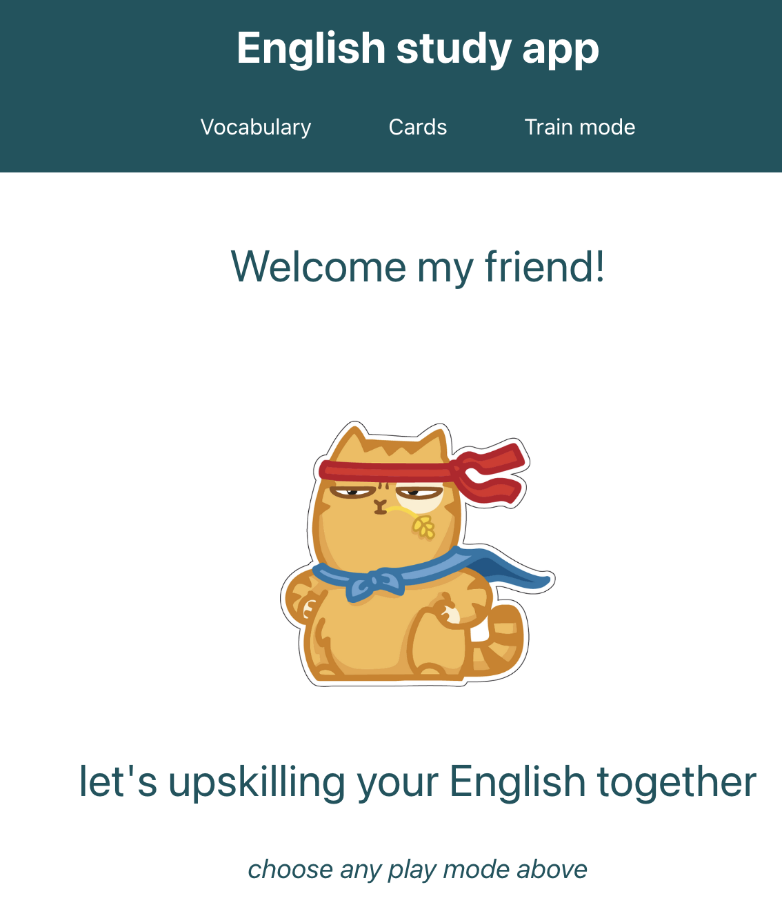
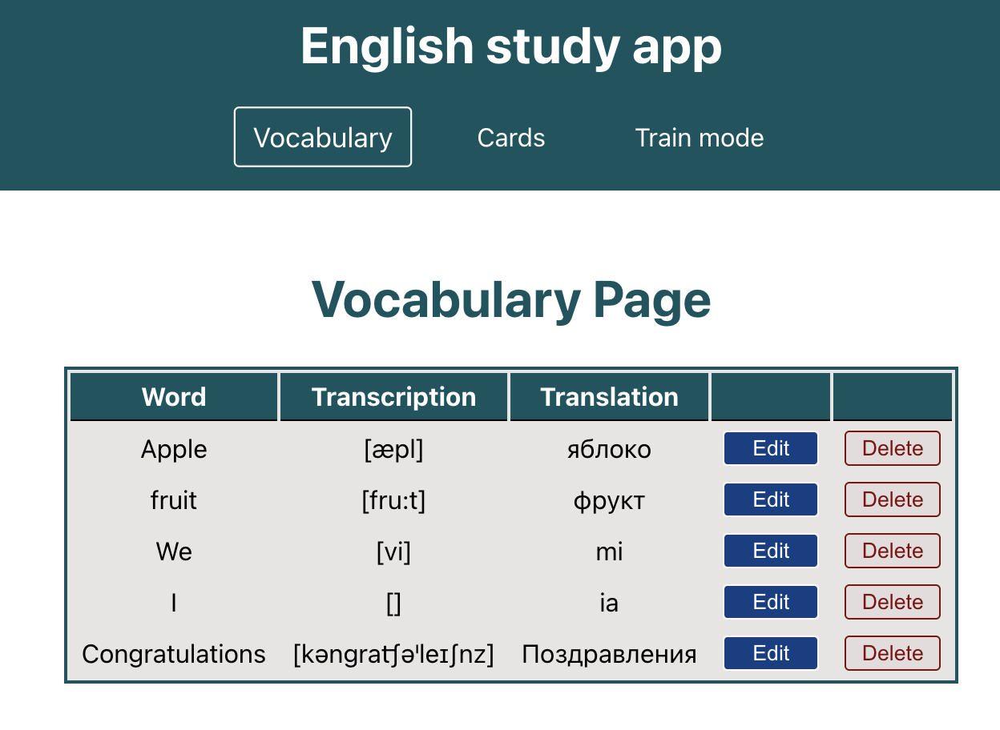
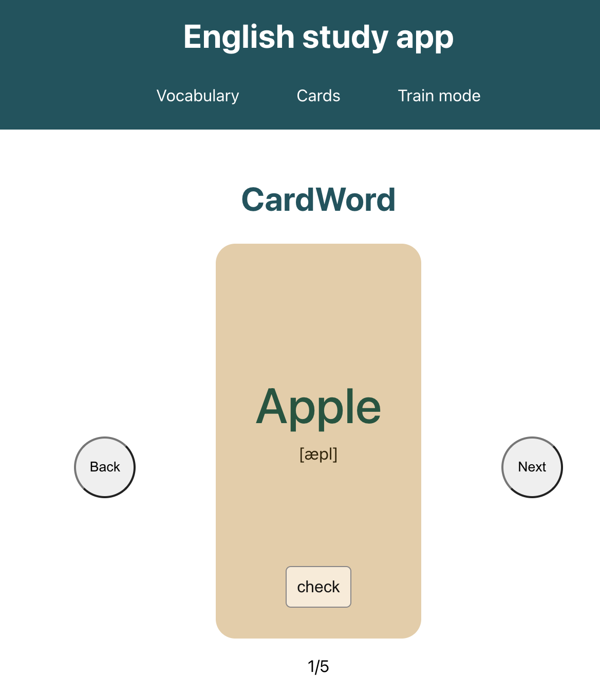
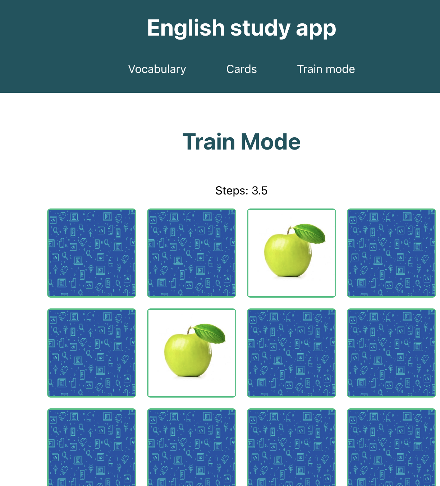

 

## learning language with 
# English Study App

try it here 
 
<a href="https://svetk0.github.io/english-study-app/">https://svetk0.github.io/english-study-app/ </a>

---
  

<h2> <b> How it works </b> </h2>

## Step 1. Look at the Welcome page

 
 
 

<h4>Choose an option: </h4> 

 -->  Vocabulary 

 -->  Cards 

 -->  Train mode  

 

 

## Step 2. Explore all features

<table align="center">
  <tr>
    <td>
   
Vocabulary

    </td>
    <td>
   
Cards

    </td>
      <td>
  
Train mode 

    </td>
  </tr>
  <tr>
    <td>
    
    </td>
    <td>
    
    </td>
      <td>
    
    </td>
  </tr>
    <tr>
    <td>
   
Manage own vocabulary list: Add, Edit, Delete

    </td>
    <td>
   
Learn new words and check yourself

    </td>
      <td>
  
Make challenge to your memory

    </td>
  </tr>
</table>

 
 

## Available Scripts
In the project directory, you can run:
### `npm start`
  
  

